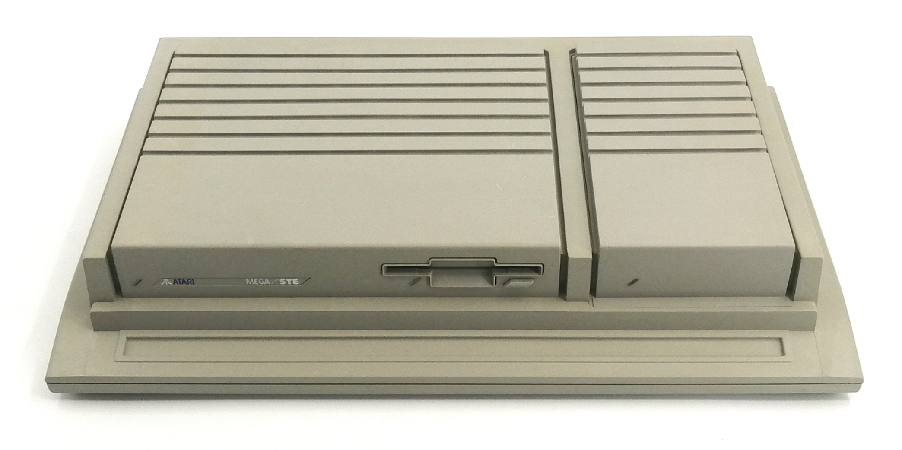
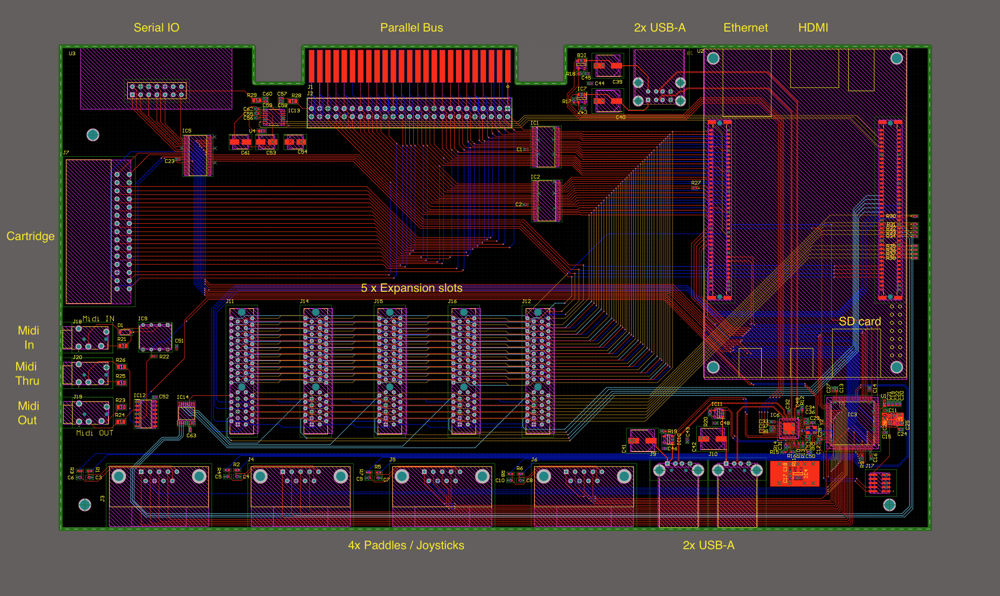
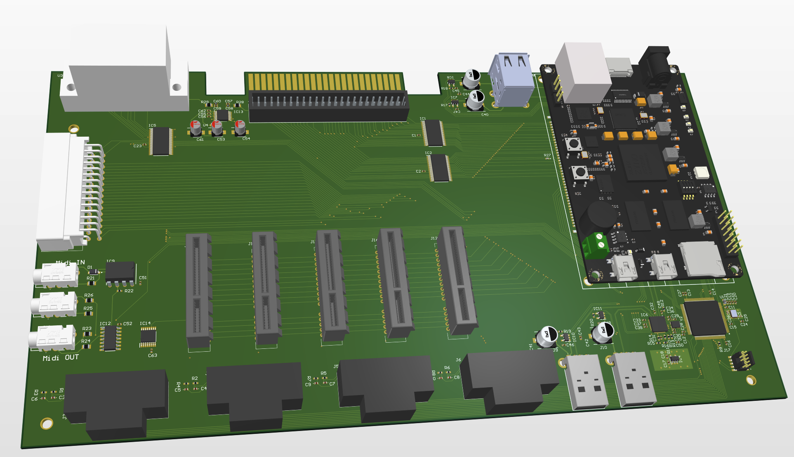

:::note
In development — the carrier is being designed. The single-chip core already runs on the
Z-Turn SOM (see [Current state](/project/current-state/)).
:::

The single-chip design runs on a **MyIR Z-Turn Zynq-7020 SOM**. The **carrier board** is the
custom PCB the SOM plugs into — it turns the core into a real Atari-XT machine by bringing out
the Atari-facing I/O the SOM doesn't have: the SIO port, cartridge slot, the PBI / expansion
bus, joysticks, audio in/out, and USB for keyboard and mouse. The carrier is **3.3 V
throughout**; the few genuinely 5 V Atari ports are level-shifted at their connectors.

## The STM32F411 I/O companion

Slow, real-time, "host-the-outside-world" jobs don't belong in FPGA fabric, so the carrier
carries an **STM32F411** as an I/O companion. It handles:

- **USB host** for HID keyboard and mouse,
- **SIO host controller** — drives the real Atari SIO DIN port, plus virtual disk / network
  peripherals in firmware,
- **Joysticks and paddles** — paddles read as RC charge-time on digital pins via timer
  input-capture, exactly like the real Atari (no ADC involved),
- **MIDI** — opto-isolated IN, current-loop OUT.

It links to the FPGA over SPI (~5 MHz) plus a few GPIO, with a UART on PS MIO for firmware
programming and runtime control. Because the emulated POKEY is register-level (no bit shifter),
SIO bytes cross that link *as bytes* — there's no UART between the FPGA and the STM32.

### Why STM32F411 for USB host, not the RP2354

The earlier plan used an **RP2354** for the USB-HID host. That role moved to the **STM32F411**
for one decisive reason: **host-mode USB is far more battle-tested there.** The F411's
USB-OTG-FS controller together with ST's USB Host library is a mature, widely-deployed host
stack, whereas TinyUSB on the RP2350 / RP2354 family is **device-mode-first** — its host support
is newer and less proven. Enumerating arbitrary keyboards, mice, and hubs is exactly the kind of
fiddly, edge-case-ridden job where the better-trodden stack wins, so the STM32 takes it.

The RP2354 isn't gone, though — it just moved to where it shines: each **expansion card** is an
RP2354, using its PIO to talk the carrier's byte-wide bus (below).

## Expansion bus

Every expansion slot carries two interfaces:

- a faithful **1090-style parallel PBI bus** (for PBI-shaped cards, via a level-shifting riser), and
- a modern **FPGA-direct byte-wide synchronous bus** — 8-bit data + clock at 25 MHz (≈ 25 MB/s),
  plus a 1 Mbit control UART, CS-selected one card at a time.

The byte-bus is single-ended 3.3 V and deliberately slow, so a "fast" card needs **no FPGA** — an
**RP2354 + PIO** drives it directly while its two cores run the card's device firmware. The
motivating use case is an ACSI / SCSI hard disk behind an ST/TT emulation, where 25 MB/s is
roughly twice what a period disk driver needs.

## Audio

A **PCM1808** stereo I²S ADC provides line-in and sampling, and captures the Atari SIO and
cart / PBI `AUDIO_IN` lines; POKEY's output rides out over the HDMI link. See
[Audio](/hardware/audio/).

## Power

A single **AP2112K** LDO supplies the 3.3 V rail — STM32F411, the USB-hub logic, the PCM1808
digital side, the bus decoder, and glue — comfortably within its 600 mA budget.

## Case

The PCB is designed to fit into a reduced-size Atari-TT/Atari MegaSTE style case...

I always thought this was the best case that Atari ever produced, so the XT case will pay homage to it.

I'm intending to have the FPGA accessible via the right ribbed-section, and have expansion slots accessible via the left section. These slots are going to be more M.2 drive sized than PCIe slot-sized, but you can fit a lot on a double-sided circuit board these days. 

So the PCB looks like:

and to pay the gratuitous 3D render tax...

Some minor work remains to be done on the PCB before it's sent off for production 